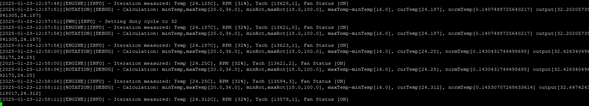
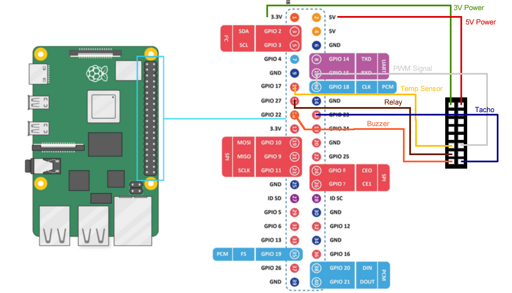
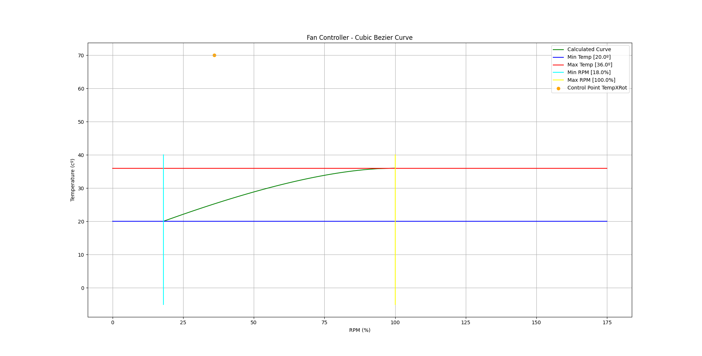

# Raspberry Pi - Fan Controller

"Fan Controller" is a Python daemon to manage and control PWM fans coded to work with Raspberry PI. It aims to regulate chassis fan speeds, shutdown and startup cycles based on custom configuration and external sensors such as temperature readings;

Fan speed is customizable via a Bezier curve in order to effectively control "fan RPM" vs "Room Temperature";

In addition, it also provides monitoring for a number of metrics such as "fan RPM", "temperature" while providing audible alerts in case of fan hardware failures;



## Requirements

- <u>Hardware</u>
  - Raspberry PI 5
  - SRD-05VDC-SL-C Relay
  - Velleman VMA319 Buzzer
  - DS18B20 Temp Sensor
  - PWM Signal Splitter
  - 12V Power supply
- <u>Software</u>
  - Debian 12 (bookworm)
  - Python 3.11.2

## Installation

Installation is done on the 2 components, hardware and software, please check accordingly:

### Hardware

The following diagram illustrates GPIO connection on the Raspberry PI per device type. A custom plug was made so it made connection easier as opposed to individually plug wire by wire;



### Software:

- #### Setup host boot configs:

  - Setup your Raspberry PI boot configuration accordingly. Open and edit `/boot/firmware/config.txt` :

    1. For the proper PWM reading, make sure the channel is enabled as a PWM emitter, `config.txt` should contain: 

       ```
       dtoverlay=pwm-2chan
       gpio=12=op,dl
       ```

    2. For the temperature reading sensor, make sure the proper pin is enabled, `config.txt` should contain:

       ```
       dtoverlay=w1-gpio,gpiopin=17
       ```
       
    3. Comment all `dtoverlay` entries found besides the ones we added:

       ```
       #dtoverlay=<xxx>
       ```

  - Enable modprobe

    1. Run the following commands to enable:

       ```
       sudo modprobe w1-gpio
       sudo modprobe w1-therm
       ```

    2. Check the sensors dir for the temp:

       ```
       cd /sys/bus/w1/devices/28-<unique_ref>
       nano w1_slave
       ```

       We should see data under temp;

- #### Install package and env:

  - Enter as root:

    ```
    sudo -i
    cd /usr/local/bin/
    ```
  
  - Clone repo:
  
    ```
    git clone https://github.com/jcv-pt/raspberry-pi-fan-controller.git
    cd raspberry-pi-fan-controller
    ```
  
  - Create a new venv:
  
    ```
    python -m venv ./fan-controller-venv
    source ./fan-controller-venv/bin/activate
    ```
  
  - Current release was run on Python 3.11.2 version. 
  
    Use the package manager [pip](https://pip.pypa.io/en/stable/) to install "Fan Controller" required libs depending on the Raspberry-pi model:
  
    - For Raspberry-pi version 3:
  
      ```
      pip install -r requirements-pi3.txt
      ```
  
    - For Raspberry-pi version 5:
  
      ```
      pip install -r requirements-pi5.txt
      ```
  


- #### Initialize and setup configurations:

  - Copy & edit the config sample file located at:

    ```
    cp data/config/sample.default.ini data/config/default.ini
    ```

  - Modify this file according to the GPIO, hardware connected and metrics, here is a full list of the configuration options available:

    - `[Temperature][MinTemp]`
      - <u>Desc</u>: *Minimum temperature lower bound. Fan will operate with temperature values higher than defined. If temperate readings report values lower than this setting, engine will start fan shutdown sequence;*
      - <u>Default</u>: `20`
    - `[Temperature][MaxTemp]`
      - <u>Desc</u>: *Maximum temperature (upper bound). Required for bezier curve calculation. Fan will operate with temperature values lower and higher than defined. If temperate readings are higher than this setting, engine will set RPM to max value;*
      - <u>Default</u>: `36`
    - `[Temperature][ControlPointTemp]`
      - <u>Desc</u>: *This is the temperature control point (y axis) in order to shape bezier curve;*
      - <u>Default</u>: `36`
    - `[Temperature][DevicePath]`
      - <u>Desc</u>: *Part of system device path for temperature reading hardware;*
      - <u>Default</u>: `/sys/bus/w1/devices/`
    - `[Temperature][DeviceFolder]`
      - <u>Desc</u>: *Part of system device path for temperature reading hardware;*
      - <u>Default</u>: `28*`
    - `[Temperature][DeviceFile]`
      - <u>Desc</u>: *Part of system device path for temperature reading hardware;*
      - <u>Default</u>: `/w1_slave`
    - `[Fan][MinRotationPercent]`
      - <u>Desc</u>: *Minimum rotation percent (lower bound). Fan will operate with rotation values higher than defined;*
      - <u>Default</u>: `18`
    - `[Fan][MaxRotationPercent]`
      - <u>Desc</u>: *Maximum rotation percent (upper bound). Fan will operate with rotation values lower than defined;*
      - <u>Default</u>: `100`
    - `[Fan][ControlPointRotationPercent]`
      - <u>Desc</u>: *This is the rotation control point (x axis) in order to shape bezier curve;*
      - <u>Default</u>: `70`
    - `[Fan][ShutdownGraceTime]`
      - <u>Desc</u>: *In minutes, time after temperature reaches MinTemp on which the fans will stop*;
      - <u>Default</u>: `1`
    - `[Fan][TachoGPIOPin]`
      - <u>Desc</u>: *GPIO pin on which the fan Tacho signal is connected to ( using GPIO.BCM )*
      - <u>Default</u>: `23`
    - `[Fan][TachoPulsesPerRev]`
      - <u>Desc</u>: *Fan Tacho pulses per revolution*;
      - <u>Default</u>: `2`
    - `[Buzzer][GPIOPin]`
      - <u>Desc</u>: *GPIOPin for the buzzer ( using GPIO.BCM )*;
      - <u>Default</u>: `22`
    - `[Buzzer][PINHighTime]`
      - <u>Desc</u>: *Amount of time in seconds for regular buzz*;
      - <u>Default</u>: `1`
    - `[Buzzer][PINHighShortTime]`
      - <u>Desc</u>: *Amount of time in seconds for short buzz*;
      - <u>Default</u>: `22`
    - `[Buzzer][IntermittentPINLowTime]`
      - <u>Desc</u>: *Amount of time in seconds to wait for next buzz while on intermittent buzz*;
      - <u>Default</u>: `22`
    - `[Relay][GPIOPin]`
      - <u>Desc</u>: *GPIOPin for the relay device ( using GPIO.BCM )*;
      - <u>Default</u>: `27`
    - `[Relay][InitialState]`
      - <u>Desc</u>: *Initial state of the relay, weather HIGH(1) or LOW(0)*;
      - <u>Default</u>: `0`
    - `[Relay][OnState]`
      - <u>Desc</u>: *On state of the relay, weather to set the pin to HIGH(0) or LOW(0)*;
      - <u>Default</u>: `0`
    - `[PWM][Channel]`
      - <u>Desc</u>: *PWM Channel (check HardwarePWM lib for futher details)*;
      - <u>Default</u>: usually `2` for RaspberryPi v5, `0` for RaspberryPi v3
    - `[PWM][ChipNo]`
      - <u>Desc</u>: *Chip No (check HardwarePWM lib for further details)*;
      - <u>Default</u>: usually `2` for RaspberryPi v5, `0` for RaspberryPi v3
    - `[PWM][Frequency]`
      - <u>Desc</u>: *PWM Frequency operation of the fan*;
      - <u>Default</u>: `25000`
    - `[Logs][MaxLogLines]`
      - <u>Desc</u>: *Max number of lines per log, once reached log is rotated;*
      - <u>Default</u>: `2000`
    - `[Logs][MaxFilesCount]`
      - <u>Desc</u>: *Number of rotated logs to keep*;
      - <u>Default</u>: `10`

- #### Install as a service:

  - In order to install "Fan Controller" as a debian service, please follow steps bellow:
  
    1. Create a service file, e.g., `/etc/systemd/system/raspberry-fan-controller.service`:
  
       ```
       [Unit]
       Description=Raspberry Fan Controller
       After=syslog.target network.target
       
       [Service]
       WorkingDirectory=/usr/local/bin/raspberry-pi-fan-controller
       ExecStart=/usr/local/bin/raspberry-pi-fan-controller/fan-controller-venv/bin/python /usr/local/bin/raspberry-pi-fan-controller/fan-controller
       Restart=always
       
       [Install]
       WantedBy=multi-user.target
       ```
  
    2. Reload service list:
  
       ```
       systemctl daemon-reload
       ```
  
    3. Enable and start the service:
  
       ```
       sudo systemctl enable raspberry-fan-controller.service
       sudo systemctl start raspberry-fan-controller.service
       ```
  
    4. Monitor output with:
  
       ```
       journalctl -S today -u raspberry-fan-controller.service
       ```

## Usage

### How to run:

"Fan Controller" can be run with:

```sh
python fan-controller
```

#### Available arguments:

| Flag       | Description                                    | Accepted Values |
| ---------- | ---------------------------------------------- | --------------- |
| -h, --help | Shows help screen with all available arguments | --              |
| --verbose  | Weather to display logging output              | 0,1             |
| --debug    | Weather to display debug data to output        | 0,1             |

## Troubleshooting

"Fan Controller" will emit sound alerts whenever there is a hardware or software as well as keeping a set of verbose logs that can be used to track issues;

### Audible Alerts

"Fan Controller" will emit audio alerts when a given set of conditions occur, namely:

| Sound Alert                                           | Description                                                  |
| ----------------------------------------------------- | ------------------------------------------------------------ |
| One single beep;                                      | Engine started;                                              |
| Continuous intermittent beep;                         | Fault indication, Engine entered "Panic" mode, check **Fault List** section; |
| One single beep, after continuous intermittent beeps; | Fault was cleared, engine was reset;                         |

### Fault List

"Fan Controller" can raise several fault types depending on the origin of the problem hardware or software based.

Here is a list of possible faults reported by the Engine:

| Possible Faults                      | Description                                                  | Likely Cause                                                 |
| ------------------------------------ | ------------------------------------------------------------ | ------------------------------------------------------------ |
| Invalid temperature reading;         | When temperature value could not be read from external sensor or value is not valid; | Usually related to hardware fault, hardware miscommunication or wrong configuration (engine or rasp); |
| Invalid rotation calculation;        | RPM could not be calculated;                                 | Usually related to misconfiguration on the engine settings. Likely wrong bezier curve points defined; |
| Tachometer issue;                    | Tachometer is reporting equal values;                        | Likely related to an hardware issue since Tachometer is reporting non disperse readings from the Fans. |
| OS / Engine related software issues; | All other sorts of exceptions unforseen due to OS events or Engine code; | None to be foreseen, check logs;                             |

In order to diagnose faults, please inspect the logs under `<root>/data/logs`/

### Panic Mode

"Fan Controller" will enter panic mode whenever there is a software or hardware fault. Engine will set RPM to max value and the buzzer will beep intermittently.

### Crash Mode

"Fan Controller" will enter crash mode whenever there is an OS or software issue that causes Engine to crash. Engine will set RPM to max value;

## Testing Devices

A number of tests are available to troubleshoot device operation, namely:

| Test             | How to run?                        | Description                                |
| ---------------- | ---------------------------------- | ------------------------------------------ |
| test-pwm         | `python tests/test-pwm.py`         | Will set PWM to both max and min rotation; |
| test-temp-sensor | `python tests/test-temp-sensor.py` | Will output current temp reading;          |
| test-buzzer      | `python tests/test-buzzer.py`      | Will enable buzzer intermittently;         |

## Simulate

"Fan Controller" also provides a visual way to check for the "RPM vs Temp", "startup" and "shutdown" conditions on the profile configured. 

#### Requirements:

In order to run simulation, 2 libs need to be installed:

- `numpy`
- `matplotlib.pyplot`

#### How to run:

"Fan Controller" simulation can be run with:

```sh
python fan-controller/engine/simulate.py
```

This should provide the UI with a similar graph:



Depending on the configuration set up, we can observe "start" and "shutdown" conditions and "RPM vs Temperature curve of operation";

## License

[MIT](https://choosealicense.com/licenses/mit/)